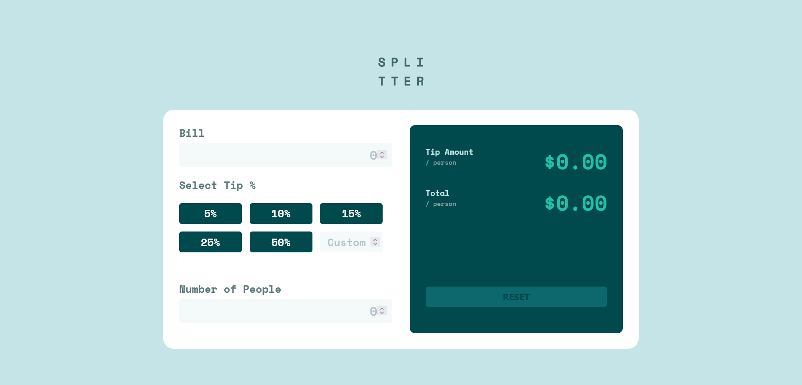

# Tip Calculator App

This is a simple tip calculator web application that allows users to calculate the tip amount based on the bill amount, tip percentage, and the number of people sharing the bill.

## Table of Contents

- [Design](#design)
- [Features](#features)
- [Usage](#usage)
- [Technologies Used](#technologies-used)
- [Demo](#demo)
- [Author](#author)

## Design

## Features

- Calculate tip based on bill amount and tip percentage.
- Customize tip percentage with predefined buttons or input custom value.
- Specify the number of people sharing the bill.
- Display total tip amount and individual tip amount per person.
- Reset button to clear inputs and results.

## Usage

1. Enter the bill amount in the input field labeled "Bill".
2. Select the desired tip percentage by clicking on one of the predefined buttons (5%, 10%, 15%, 25%, 50%) or input a custom tip percentage in the provided field.
3. Specify the number of people sharing the bill in the input field labeled "Number of People". Note that this field cannot be left empty.
4. The total tip amount and individual tip amount per person will be displayed in the result section.
5. To reset the form and clear all inputs and results, click the "Reset" button. The reset button is disabled until any input is entered.

## Technologies Used

- HTML5
- CSS3
- JavaScript

## Demo

You can view a live demo of the tip calculator app **[Here](https://basemsameh.github.io/Tip-Calculator-App/)**. (Replace # with the actual link to your live demo if available)

## Author

- Linkedin - [Basem Sameh](https://www.linkedin.com/in/basem-sameh-671b5b212/)
- Frontend Mentor - [@basemsameh](https://www.frontendmentor.io/profile/basemsameh)